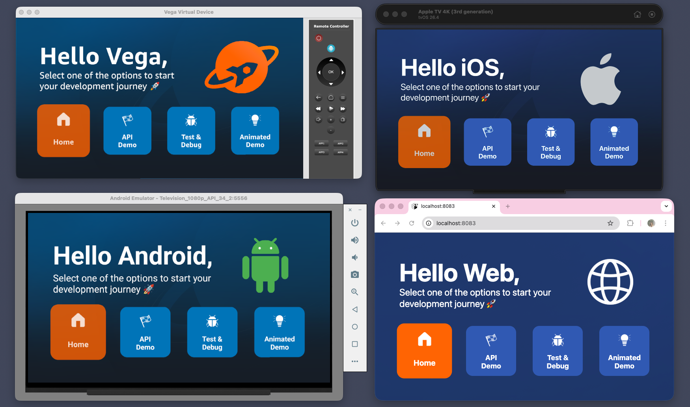

# Multi-TV Hello World Workshop

A hands-on workshop and working reference app for building React Native TV apps that run on Fire TV (Vega OS), Android TV, Apple TV, and the web from a single shared codebase.



## What you'll build in the workshop

You start with a working monorepo that already has a simple tile-based UI. The plumbing (Yarn workspaces, Metro configs, TypeScript setup) is done. Your job is the interesting bits:

- A shared `Header` component that shows a different logo per platform
- A Lottie-powered animated logo with a web fallback
- A shared API demo that fetches data from a public endpoint
- The same app running on multiple TV platforms and the web

Along the way you'll learn:

- How to set up the Vega SDK and run a React Native app on Fire TV
- TV-specific patterns: focus management, D-pad navigation, 1080p scaling
- How a Yarn workspaces monorepo shares code across TV platforms
- Two approaches to platform-specific code: file extensions (`.kepler.tsx`, `.web.tsx`) vs. `Platform.select()`
- Adding native modules (Lottie animations) with platform-specific fallbacks
- Sharing network logic and utilities across all platforms

## Workshop steps

| Step                                                                  | What you'll do                                             | What you'll learn                                          |
| --------------------------------------------------------------------- | ---------------------------------------------------------- | ---------------------------------------------------------- |
| [Step 0: Prerequisites](./workshop/step-00-prerequisites.md)          | Install the Vega SDK, configure Yarn, install dependencies | Environment setup, required tools                          |
| [Step 1: Set up and run the app](./workshop/step-01-setup-and-run.md) | Run the app on Fire TV and web                             | Monorepo structure, building and running for Vega          |
| [Step 2: Add a shared Header](./workshop/step-02-shared-header.md)    | Create a Header component with platform-specific logos     | File extensions vs. Platform.select(), platform resolution |
| [Step 3: Add a Lottie animation](./workshop/step-03-add-animation.md) | Add an animated React Native logo with a web fallback      | Native modules, platform-specific fallbacks, Lottie        |
| [Step 4: Add an API demo](./workshop/step-04-add-api-demo.md)         | Fetch data from a public API in a shared component         | Network requests, shared utilities, fetch across platforms |
| [Step 5: Movie list](./workshop/step-05-movie-list.md)                | Replace Test & Debug with a movie list, FlatList vs Carousel | Reusing the shared httpClient, TV list performance, platform-specific list components |

The `final-app` branch contains the completed version with all steps applied. Compare your progress at any point by checking out `final-app`.

## Project structure

This project uses [Yarn workspaces](https://yarnpkg.com/features/workspaces) to manage multiple packages in a single repository.

```
├── package.json                 # Root workspace config (Yarn 4)
├── .yarnrc.yml                  # Yarn config (node-modules linker, hoisting limits)
├── packages/
│   ├── shared/                  # @multitv/shared
│   │   ├── src/
│   │   │   ├── components/      # Header, HeaderLogo, Tile, ApiDemo, IconReactNativeAnimated
│   │   │   ├── screens/         # HomeScreen
│   │   │   ├── data/            # Tile definitions
│   │   │   ├── services/        # HTTP client (fetch-based)
│   │   │   ├── utils/           # Scaling utilities
│   │   │   └── assets/          # Platform logos, background images
│   │   └── index.ts             # Public API exports
│   ├── expotv/                  # @multitv/expotv
│   │   ├── app/                 # Expo Router pages
│   │   ├── components/          # TV-specific components
│   │   ├── layouts/             # Tab layouts (native + web)
│   │   ├── hooks/               # useScale, useColorScheme, useTextStyles
│   │   ├── constants/           # Colors, TextStyles
│   │   └── assets/              # Images, fonts, TV icons
│   └── vega/                    # @multitv/vega
│       ├── src/
│       │   └── App.tsx
│       ├── test/
│       ├── manifest.toml
│       └── package.json
```

**`packages/shared`** contains all the cross-platform code: components, screens, scaling utilities, and services. It has no platform runtime of its own, it's consumed by the other two packages.

**`packages/vega`** is the Fire TV app. It uses React Native Kepler (Vega's RN runtime) and imports from `@multitv/shared`. When you run `yarn vega:build`, it bundles the shared code along with the Vega entry point into a `.vpkg` file that runs on Fire TV.

**`packages/expotv`** is the Expo TV app. It targets Android TV, Apple TV, and web using `react-native-tvos` and Expo. It also imports from `@multitv/shared`, so the same components render on all its target platforms.

You write components once in `shared/`, and both `vega/` and `expotv/` consume them. Platform-specific differences are handled via file extensions (`.kepler.tsx`, `.android.tsx`, `.ios.tsx`, `.web.tsx`) or `Platform.select()`. The workshop covers both approaches.

## Tech Stack

|              | Expo TV                       | Vega (Fire TV)                                      |
| ------------ | ----------------------------- | --------------------------------------------------- |
| Framework    | Expo SDK 54                   | Kepler (@amazon-devices/react-native-kepler ^2.0.0) |
| React        | 19.1.0                        | 18.2.0                                              |
| React Native | react-native-tvos 0.81-stable | 0.72.0                                              |
| TypeScript   | ~5.9.2                        | 4.8.4                                               |

## Notes

The Expo TV app (`packages/expotv/`) was scaffolded from the default Expo TV template. Some boilerplate files from the template (e.g. `HelloWave`, `ParallaxScrollView`, `ExternalLink`) are still present and not used by the shared components. They're harmless but can be removed if you want a cleaner setup.

## Troubleshooting

Common issues and fixes live in the workshop [Commands and troubleshooting](./workshop/commands-and-troubleshooting.md) file, alongside a quick reference for every yarn script used in the workshop.

## Related Resources

- [React Native Documentation](https://reactnative.dev/)
- [React Native TvOS](https://github.com/react-native-tvos/react-native-tvos)
- [Vega Developer Portal](https://developer.amazon.com/docs/vega/vega.html)
- [Expo Documentation](https://docs.expo.dev/)
- [Yarn Workspaces](https://yarnpkg.com/features/workspaces)

## License

See [LICENSE](LICENSE) file.
