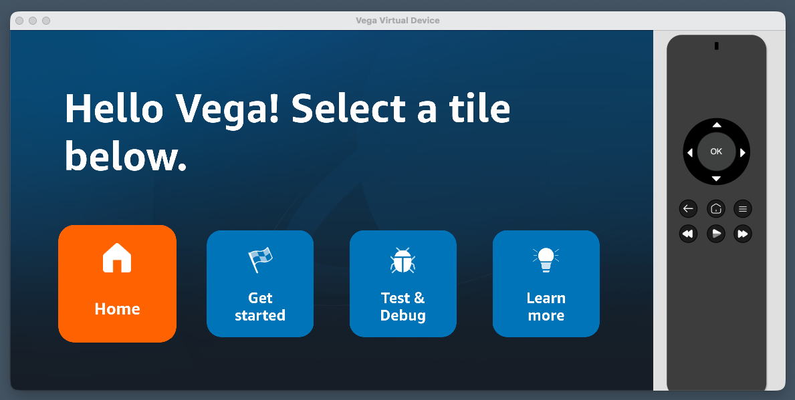

# Step 1: Set up and run the app

In this step you'll install the Vega SDK, clone this repo, and get the app running on both Fire TV and web.

## 1.1 Install the Vega SDK

Follow the official guides to get the Vega developer tools set up:

1. **[Install the Vega Developer Tools](https://developer.amazon.com/docs/vega/latest/install-vega-sdk.html)** - installs the `vega` CLI, the Vega Virtual Device, and React Native Kepler
2. **[Configure Yarn for Vega](https://developer.amazon.com/docs/vega/latest/configure-package-managers.html)** - sets up Yarn to resolve Amazon device packages

## 1.2 Verify your environment

```bash
# Vega CLI installed
vega --version

# Node.js 18+
node --version

# Yarn 4+
yarn --version
```

## 1.3 Install dependencies

From the root of this repo, install all workspace dependencies:

```bash
yarn
```

## 1.4 Understand the project structure

This is a Yarn workspaces monorepo, already configured and ready to go. You don't need to set any of this up - it's here so you can focus on building components.

```
├── package.json              # Root workspace config (Yarn 4)
├── packages/
│   ├── shared/               # @multitv/shared - components used by all platforms
│   ├── vega/                 # @multitv/vega - Fire TV app
│   └── expotv/               # @multitv/expotv - Android TV, Apple TV, and web
```

The Vega app (`packages/vega`) imports components from the shared package (`packages/shared`). The Expo TV app (`packages/expotv`) does the same. Any component you add to the shared package is immediately available on all platforms.

Take a look at `packages/vega/src/App.tsx` - it's the entry point for the Fire TV app:

```tsx
import React from 'react';
import {StyleSheet, ImageBackground} from 'react-native';
import {HomeScreen} from '@multitv/shared';

export const App = () => {
  return (
    <ImageBackground
      source={require('./assets/background.png')}
      style={styles.background}>
      <HomeScreen />
    </ImageBackground>
  );
};
```

Simple: it renders the shared `HomeScreen` inside a background image.

## 1.5 Run on Vega (Fire TV)

Build the app:

```bash
yarn vega:build
```

Start the Vega Virtual Device:

```bash
vega virtual-device start
```

Run the app:

```bash
# Mac M-series (Apple Silicon)
yarn vega:vvd:mseries

# Intel Mac
yarn vega:vvd:intel
```

You should see a tile-based UI with four tiles: Home, Get Started, Test & Debug, and Learn More. Use the arrow keys (D-pad) to navigate between them.



## 1.6 Run on another platform

The same shared code also runs via the Expo TV package. For this workshop we'll use web as the second target since it requires no additional setup, but if you have Android Studio or are comfortable with Xcode, you can target Android TV or Apple TV too.

**Web (no extra setup needed):**
```bash
yarn expotv:web
```

**Android TV (requires Android Studio with a TV system image):**
```bash
yarn expotv:prebuild
yarn expotv:android
```

**Apple TV (requires Xcode):**
```bash
yarn expotv:prebuild
yarn expotv:ios
```

For the rest of this workshop, we'll show `yarn expotv:web` as the second platform command. Substitute your preferred target if you'd rather see it on a TV emulator.

## What you've got so far

- A monorepo with shared components running on multiple platforms (Vega, Android TV, Apple TV, web)
- Focus management via `TouchableOpacity` with `onFocus`/`onBlur` handlers
- Scaling utilities that map a 1920x1080 design to the actual screen size
- A simple text header when the Home tile is focused
- Four tiles with descriptions that appear when focused

What's missing: the header doesn't tell you which platform you're on, and there's no visual difference between platforms. Let's fix that.

---

**Next:** [Step 2: Add a shared Header →](./step-02-shared-header.md)
