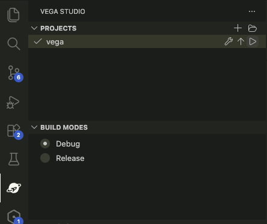

# Step 1: Set up and run the app

In this step you'll get the app running on both Fire TV and web.

> **Before you start:** Make sure you've completed [Step 0: Prerequisites](./step-00-prerequisites.md). You'll need the Vega SDK installed, Yarn configured, and dependencies installed.

## 1.1 Understand the project structure

This is a Yarn workspaces monorepo, already configured and ready to go.

```
├── package.json              # Root workspace config (Yarn 4)
├── packages/
│   ├── shared/               # @multitv/shared - components used by all platforms
│   ├── vega/                 # @multitv/vega - Fire TV app
│   └── expotv/               # @multitv/expotv - Android TV, Apple TV, and web
```

The Vega app (`packages/vega`) imports components from the shared package (`packages/shared`). The Expo TV app (`packages/expotv`) does the same. Any component you add to the shared package is immediately available on all platforms.

Take a look at `packages/vega/src/App.tsx` - it's the entry point for the Fire TV app and it renders the shared `HomeScreen` inside a background image.

```tsx
import React from 'react';
import {StyleSheet, ImageBackground} from 'react-native';
import {HomeScreen} from '@multitv/shared';

export const App = () => {
  return (
    <ImageBackground
      source={require('./assets/background.png')}
      style={styles.background}>
      <HomeScreen />
    </ImageBackground>
  );
};
```

## 1.2 Run on Vega (Fire TV)

You can build and run using either the CLI or the [Vega Studio IDE extension](https://developer.amazon.com/docs/vega/0.24/setup-extension.html). We recommend the IDE, which provides build, run, and device management directly from the sidebar panel.

Vega Studio also has [monorepo support](https://developer.amazon.com/docs/vega/0.24/monorepo-support.html) that automatically detects the workspace layout and imports Vega sub-packages when you open the project.

### Option A: Build and run from Vega Studio IDE

Open the project in your IDE, then use the Vega Studio sidebar to pick a build mode and run the app.



Pick **Debug** during development (enables Fast Refresh), or **Release** for a production-style build. From here you can build, deploy, and manage devices without leaving the IDE.

### Option B: Build and run from the CLI

#### Build the app

```bash
# Debug build (recommended for development, enables Fast Refresh)
yarn workspace @multitv/vega run build:debug

# Release build
yarn workspace @multitv/vega run build:release

# Or use the shorthand
yarn vega:build
```

#### Run on a Vega Virtual Device

Start the Vega Virtual Device:

```bash
vega virtual-device start
```

Then run the app:

```bash
# Mac M-series (Apple Silicon) - using yarn script
yarn vega:vvd:mseries

# Intel Mac - using yarn script
yarn vega:vvd:intel

# Or directly with the Vega CLI
# Mac M-series (aarch64)
vega run-app packages/vega/build/aarch64-debug/vega_aarch64.vpkg com.amazondeveloper.hellosharedworkspace.main -d VirtualDevice

# Intel Mac (x86_64)
vega run-app packages/vega/build/x86_64-debug/vega_x86_64.vpkg com.amazondeveloper.hellosharedworkspace.main -d VirtualDevice
```

You should see a tile-based UI with four tiles: Home, Get Started, Test & Debug, and Learn More. Use the arrow keys (D-pad) to navigate between them.


#### Run on a Fire TV Stick

Before you can deploy to a real Fire TV Stick, put the device into **developer mode**. Follow the [Enable Developer Mode guide](https://developer.amazon.com/docs/vega/0.24/developer-mode.html) — it walks you through enabling ADB debugging on the device, pairing it with your machine, and grabbing the DSN (device serial number) you'll pass to the `vega run-app` command below.

Once developer mode is on and you have the DSN, replace `<DSN>` in the commands below:

```bash
# Using the yarn script
yarn vega:firetv <DSN>

# Or directly
vega run-app packages/vega/build/armv7-release/vega_armv7.vpkg com.amazondeveloper.hellosharedworkspace.main -d <DSN>
```

The `vega run-app` command takes the form `vega run-app <Vpkg path> <App ID> -d <device>`. The App ID is the interactive component id from `manifest.toml` (here, `com.amazondeveloper.hellosharedworkspace.main`). Use `VirtualDevice` for the VVD or the device serial number (DSN) for a Fire TV Stick. See the [Vega CLI reference](https://developer.amazon.com/docs/vega/0.24/cli-tools.html) for details.

[Fast Refresh](https://reactnative.dev/docs/fast-refresh) is available in debug builds. See [Set Up Fast Refresh](https://developer.amazon.com/docs/vega/0.24/fast-refresh.html) for configuration.

## 1.3 Run on another platform

The same shared code also runs via the Expo TV package. For this workshop we'll use web as the second target since it requires no additional setup, but if you have Android Studio or are comfortable with Xcode, you can target Android TV or Apple TV too.

> **Note:** Apple TV (iOS) must run on port 8081. Avoid running Vega and Expo TV builds at the same time, as they use separate Metro instances that can conflict.

Prebuild the native projects first (only needed for Android TV and Apple TV):

```bash
yarn expotv:prebuild
```

Then run on your target platform:

**Web (no extra setup needed):**

```bash
yarn expotv:web
```

**Android TV (requires Android Studio with a TV system image):**

```bash
yarn expotv:android
```

**Apple TV (requires Xcode):**

```bash
yarn expotv:ios
```

For the rest of this workshop, we'll show `yarn expotv:web` as the second platform command. Substitute your preferred target if you'd rather see it on a TV emulator.

## What you've got so far

- A monorepo with shared components running on multiple platforms (Vega, Android TV, Apple TV, web)
- Focus management via `TouchableOpacity` with `onFocus`/`onBlur` handlers
- Scaling utilities that map a 1920x1080 design to the actual screen size
- A simple text header when the Home tile is focused
- Four tiles with descriptions that appear when focused

What's missing: the header doesn't tell you which platform you're on, and there's no visual difference between platforms. Let's fix that.

---

**Next:** [Step 2: Add a shared Header →](./step-02-shared-header.md)
