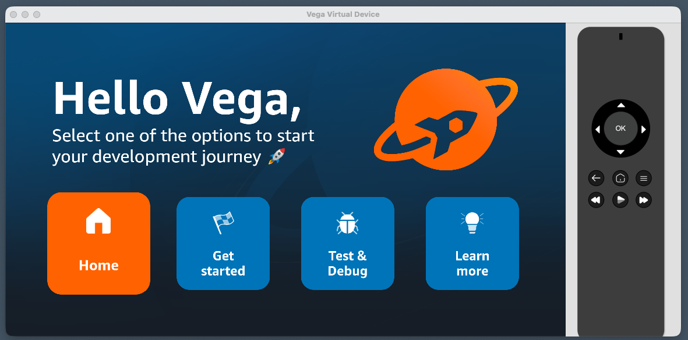
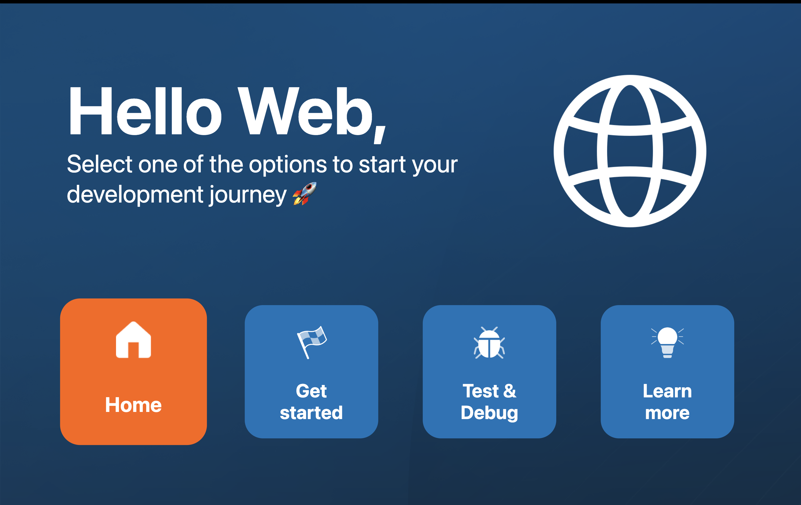

# Step 2: Add a shared Header with platform-specific logos

Right now the app shows plain text when the Home tile is focused. In this step, you'll add a `Header` component that displays a greeting and a platform logo. The logo will be different depending on whether the app is running on Vega (Fire TV) or web.

This introduces two approaches to platform-specific code in React Native:
- **`Platform.select()`** - for simple inline values (strings, styles)
- **Platform file extensions** (`.kepler.tsx`, `.web.tsx`) - for entire component variants

## 2.1 Create the Header component

Create the file `packages/shared/src/components/Header/Header.tsx`:

```tsx
import React from 'react';
import {View, Text, Platform, StyleSheet} from 'react-native';
import {scaleFontSize, scaleWidth, scaleHeight} from '../../utils/scaling';
import {HeaderLogo} from './HeaderLogo';

const platformName = Platform.select({
  ios: 'iOS',
  android: 'Android',
  web: 'Web',
  default: 'Vega',
});

export const Header = () => {
  return (
    <View style={styles.container}>
      <View style={styles.textContainer}>
        <Text style={styles.headerText}>Hello {platformName},</Text>
        <Text style={styles.subHeaderText}>
          Select one of the options to start your development journey 🚀
        </Text>
      </View>
      <HeaderLogo style={styles.vegaLogo} />
    </View>
  );
};

const styles = StyleSheet.create({
  container: {
    flexDirection: 'row',
    alignItems: 'flex-start',
    width: '100%',
  },
  textContainer: {
    flex: 1,
  },
  headerText: {
    color: '#FFFFFF',
    fontSize: scaleFontSize(160),
    fontWeight: 'bold',
  },
  subHeaderText: {
    color: '#FFFFFF',
    fontSize: scaleFontSize(60),
  },
  vegaLogo: {
    width: scaleWidth(500),
    height: scaleHeight(350),
    marginLeft: scaleWidth(80),
    resizeMode: 'contain',
  },
});
```

Notice `Platform.select()` at the top. This is approach #1: it returns a different string based on the platform. Simple, works well for values. But what about the logo?

## 2.2 Platform-specific file extensions

For the logo, each platform needs a different image. Rather than a big `if/else` chain, React Native's bundler (Metro) can resolve different files based on platform extensions.

When you import `'./HeaderLogo'`, Metro looks for a file matching the current platform:

1. `HeaderLogo.kepler.tsx` (on Vega/Fire TV)
2. `HeaderLogo.android.tsx` (on Android TV)
3. `HeaderLogo.ios.tsx` (on Apple TV)
4. `HeaderLogo.web.tsx` (on web)
5. `HeaderLogo.tsx` (fallback if none of the above match)

Create these files in `packages/shared/src/components/Header/`:

**`HeaderLogo.tsx`** (default - used on Vega):
```tsx
import React from 'react';
import {Image, ImageStyle} from 'react-native';

export interface HeaderLogoProps {
  style?: ImageStyle;
}

export const HeaderLogo = ({style}: HeaderLogoProps) => {
  return (
    <Image
      source={require('../../assets/vega.png')}
      style={style}
      resizeMode="contain"
    />
  );
};
```

Now create four platform-specific variants next to `HeaderLogo.tsx`. Each file is a copy of the default above with one change — a different `require` path (and web also tints the image white):

| File | Change vs. default |
|---|---|
| `HeaderLogo.kepler.tsx` | `require('../../assets/vega.png')` |
| `HeaderLogo.android.tsx` | `require('../../assets/android.png')` |
| `HeaderLogo.ios.tsx` | `require('../../assets/apple.png')` |
| `HeaderLogo.web.tsx` | `require('../../assets/web.png')`, plus `style={[style, {tintColor: '#FFFFFF'}]}` |

The image assets (`vega.png`, `android.png`, `apple.png`, `web.png`) already exist in `packages/shared/src/assets/`.

## 2.3 Export the Header from the shared package

Update `packages/shared/index.ts` to export the new component. Add this line at the top:

```tsx
export {Header} from './src/components/Header/Header';
```

## 2.4 Use the Header in HomeScreen

Update `packages/shared/src/screens/HomeScreen.tsx` to import and use the Header.

Replace the `renderFocusedContent` function's home case:

```tsx
// Add this import at the top
import {Header} from '../components/Header/Header';

// Then in renderFocusedContent, replace the home case:
if (focusedTileId === 'home') {
  return <Header />;
}
```

## 2.5 Run and compare

Build and run on Vega. In Vega Studio, click the play button in the sidebar (see [Step 1](./step-01-setup-and-run.md#option-a-build-and-run-from-vega-studio-ide)). Or from the CLI:

```bash
yarn vega:build
yarn vega:vvd:mseries  # or yarn vega:vvd:intel
```

You should see "Hello Vega," with the Vega logo.



Now run on web:
```bash
yarn expotv:web
```

Or run on Android TV (`yarn expotv:android`) or Apple TV (`yarn expotv:ios`) if you have those emulators set up. See [Step 1: Run on another platform](./step-01-setup-and-run.md#13-run-on-another-platform).

You should see "Hello Web," with the web logo. Same component, different presentation per platform.



## What you've learned

**`Platform.select()`** works well for:
- Inline values (strings, numbers, styles)
- Simple conditional logic
- Cases where the difference is a value, not a component

**Platform file extensions** work well for:
- Entirely different component implementations per platform
- Different native modules or assets
- Cases where the logic diverges significantly

The rule of thumb: if the difference is a value, use `Platform.select()`. If the difference is behaviour or structure, use file extensions.

---

**Next:** [Step 3: Add a Lottie animation →](./step-03-add-animation.md)
