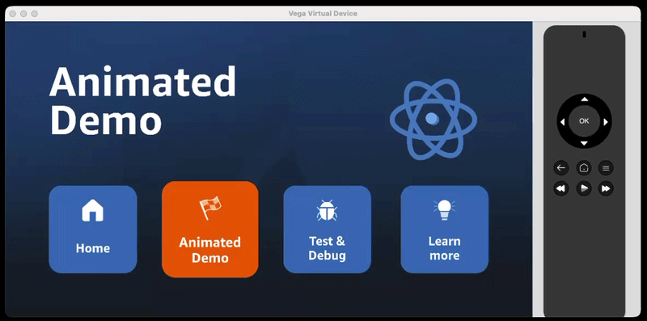
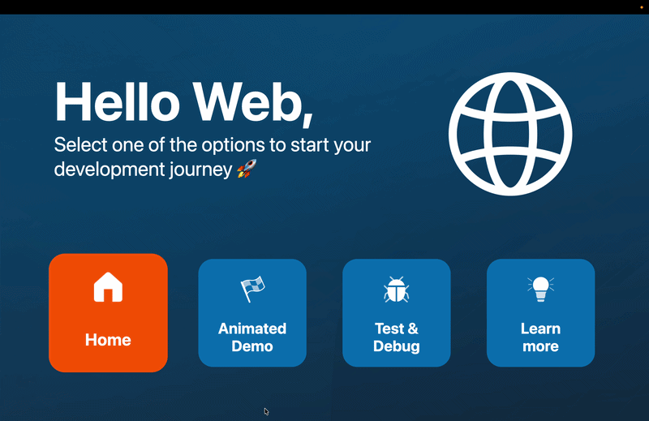

# Step 3: Add a Lottie animation

In this step, you'll add an animated React Native logo using [Lottie](https://airbnb.io/lottie/). This demonstrates how to handle a native module that isn't available on all platforms - Lottie works on Vega via `@amazon-devices/lottie-react-native`, but doesn't run on web, so you'll create a platform-specific fallback.

## 3.1 Understand the dependency situation

The Vega package already has `@amazon-devices/lottie-react-native` as a dependency (check `packages/vega/package.json`). This is a Vega compatible version of the popular `lottie-react-native` library.

The shared package lists `lottie-react-native` as a peer dependency, and the Vega Metro config aliases it to the Amazon Devices version:

```js
// packages/vega/metro.config.js (already configured)
extraNodeModules: {
  'lottie-react-native': path.resolve(projectRoot, 'node_modules', '@amazon-devices', 'lottie-react-native'),
},
```

This means the shared package can import from `lottie-react-native` and it resolves correctly on Vega. On web, there's no Lottie runtime, so you'll provide an empty fallback.

## 3.2 Create the animation component

Create the folder `packages/shared/src/components/IconReactNativeAnimated/`.

**`IconReactNativeAnimated.tsx`** (used on Vega):

```tsx
import React, {useRef, useEffect} from 'react';
import {StyleSheet} from 'react-native';
import LottieView from 'lottie-react-native';
import {scaleWidth, scaleHeight} from '../../utils/scaling';

export const IconReactNativeAnimated = () => {
  const animationRef = useRef<LottieView>(null);

  useEffect(() => {
    animationRef.current?.play();
  }, []);

  return (
    <LottieView
      ref={animationRef}
      source={require('../../assets/Animation-rn-logo.json')}
      style={styles.lottieAnimation}
    />
  );
};

const styles = StyleSheet.create({
  lottieAnimation: {
    width: scaleWidth(400),
    height: scaleHeight(400),
  },
});
```

**`IconReactNativeAnimated.web.tsx`** (web fallback using React Native's Animated API):

```tsx
import React, {useRef, useEffect} from 'react';
import {Animated, StyleSheet, Easing} from 'react-native';
import {scaleWidth, scaleHeight} from '../../utils/scaling';

export const IconReactNativeAnimated = () => {
  const spinValue = useRef(new Animated.Value(0)).current;

  useEffect(() => {
    Animated.loop(
      Animated.timing(spinValue, {
        toValue: 1,
        duration: 3000,
        easing: Easing.linear,
        useNativeDriver: true,
      }),
    ).start();
  }, [spinValue]);

  const spin = spinValue.interpolate({
    inputRange: [0, 1],
    outputRange: ['0deg', '360deg'],
  });

  return (
    <Animated.Image
      source={require('../../assets/react-logo.png')}
      style={[styles.logo, {transform: [{rotate: spin}]}]}
    />
  );
};

const styles = StyleSheet.create({
  logo: {
    width: scaleWidth(300),
    height: scaleHeight(300),
    resizeMode: 'contain',
  },
});
```

Lottie requires native rendering that isn't available on web, so the web version uses React Native's built-in `Animated` API to spin a static React Native logo instead. Same component name, same import path, completely different implementation. The `react-logo.png` asset is already in `packages/shared/src/assets/`.

## 3.3 Replace the Get Started tile

Update `packages/shared/src/data/tiles.tsx`. Replace the "Get Started" tile with the animation tile:

```tsx
  {
    id: 'animation',
    label: 'Animated\nDemo',
    accessibilityLabel: 'Animated Demo',
    description: 'A Lottie animation demo powered by React Native.',
    icon: require('../assets/get-started.png'),
  },
```

## 3.4 Update HomeScreen to show the animation

Update `packages/shared/src/screens/HomeScreen.tsx`:

1. Add the imports at the top:

```tsx
import {IconReactNativeAnimated} from '../components/IconReactNativeAnimated/IconReactNativeAnimated';
import {scaleHeight} from '../utils/scaling';
```

2. In `renderFocusedContent`, update the non-home case to handle the animation tile separately:

```tsx
return (
  <>
    <Text style={styles.focusedTitle}>{focusedTile?.label}</Text>
    {focusedTileId === 'animation' && (
      <View style={styles.animationWrapper}>
        <IconReactNativeAnimated />
      </View>
    )}
    {focusedTileId !== 'animation' && focusedTile?.description && (
      <Text style={styles.focusedDescription}>{focusedTile.description}</Text>
    )}
  </>
);
```

3. Add the animation wrapper style:

```tsx
animationWrapper: {
  flex: 1,
  alignItems: 'flex-end',
  justifyContent: 'center',
},
```

## 3.5 Run and verify

Build and run on Vega:

```bash
yarn vega:build
yarn vega:vvd:mseries
```

Navigate to the "Animated Demo" tile. You should see the React Native logo animating.



Run on web:

```bash
yarn expotv:web
```

Navigate to the "Animated Demo" tile. You should see a spinning React Native logo. On Vega it's a Lottie animation, on web it's React Native's `Animated` API rotating a static image. Same component name, same import, different implementation per platform.



## Bonus: Run on Android TV

If you have Android Studio set up, this is where the monorepo really shines:

```bash
yarn expotv:prebuild
yarn expotv:android
```

The same `lottie-react-native` import resolves to the standard community package on Android TV - no aliasing needed. On Vega, the Metro config's `extraNodeModules` remaps it to `@amazon-devices/lottie-react-native` (the Kepler-compatible build). This is VMRP (Vega Module Resolver Preset) in action: same import path in your shared code, different native implementation resolved at build time per platform.

Your shared component doesn't know or care which Lottie binary it's running against. That's the point.

## What you've learned

- **Native module differences**: Lottie has a Kepler-specific build (`@amazon-devices/lottie-react-native`) that the Metro config aliases transparently
- **Meaningful fallbacks**: Rather than an empty component, the web version uses React Native's `Animated` API to achieve a similar effect without native dependencies
- **The pattern**: import from a generic path (`lottie-react-native`), let the Metro config and platform extensions handle the rest. The consuming code doesn't know or care which implementation it gets.

## What's next

You now have a multi-platform TV app with shared components, platform-specific logos, and native module support with fallbacks.

---

**Next:** [Step 4: Add an API demo →](./step-04-add-api-demo.md)
