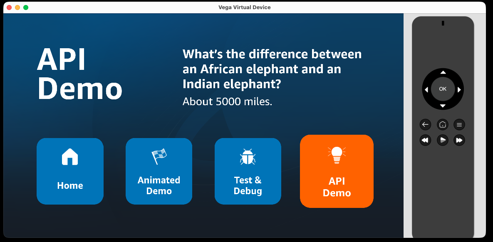

# Step 4: Add an API demo

In this step, you'll add a tile that fetches a random joke from a public API. This demonstrates how to handle network requests in a shared component that works identically across Vega and web.

You'll build a simple HTTP client utility and an `ApiDemo` component that shows a loading state, error handling, and the fetched data.

## 4.1 Create the HTTP client

Create `packages/shared/src/services/httpClient.ts`:

```ts
export interface HttpClientConfig {
  baseUrl?: string;
}

export interface HttpResponse<T = unknown> {
  data: T;
  ok: boolean;
  status: number;
}

export function createHttpClient(config: HttpClientConfig = {}) {
  const baseUrl = config.baseUrl ?? '';
  const buildUrl = (path: string) =>
    /^https?:\/\//.test(path) ? path : `${baseUrl}${path}`;

  return {
    async get<T = unknown>(path: string): Promise<HttpResponse<T>> {
      const response = await fetch(buildUrl(path));
      const data = (await response.json().catch(() => null)) as T;
      return {data, ok: response.ok, status: response.status};
    },
  };
}
```

This is a thin wrapper around `fetch` that works on both Vega and web. No platform-specific code needed — `fetch` is available everywhere. You can extend it later (POST, custom headers, timeouts via `AbortController`) once you actually need those; this workshop only needs `GET`.

## 4.2 Create the ApiDemo component

Create `packages/shared/src/components/ApiDemo.tsx`:

```tsx
import React, {useState, useEffect, useCallback} from 'react';
import {View, Text, StyleSheet, ActivityIndicator} from 'react-native';
import {createHttpClient} from '../services/httpClient';
import {scaleFontSize, scaleWidth, scaleHeight} from '../utils/scaling';

interface Joke {
  id: number;
  setup: string;
  punchline: string;
}

const httpClient = createHttpClient({
  baseUrl: 'http://official-joke-api.appspot.com',
  timeout: 10000,
});

export const ApiDemo = () => {
  const [joke, setJoke] = useState<Joke | null>(null);
  const [loading, setLoading] = useState(false);
  const [error, setError] = useState<string | null>(null);

  const fetchJoke = useCallback(async () => {
    setLoading(true);
    setError(null);
    try {
      const response = await httpClient.get<Joke>('/random_joke');
      if (response.ok) {
        setJoke(response.data);
      } else {
        setError(`Request failed with status ${response.status}`);
      }
    } catch (err) {
      setError(err instanceof Error ? err.message : 'Unknown error');
    } finally {
      setLoading(false);
    }
  }, []);

  useEffect(() => {
    fetchJoke();
  }, [fetchJoke]);

  if (loading) {
    return <ActivityIndicator size="large" color="#FFFFFF" />;
  }

  if (error) {
    return <Text style={styles.description}>{error}</Text>;
  }

  if (joke) {
    return (
      <View style={styles.jokeContainer}>
        <Text style={styles.jokeSetup}>{joke.setup}</Text>
        <Text style={styles.jokePunchline}>{joke.punchline}</Text>
      </View>
    );
  }

  return null;
};

const styles = StyleSheet.create({
  description: {
    color: '#FFFFFF',
    fontSize: scaleFontSize(60),
    lineHeight: scaleFontSize(80),
    flex: 1,
  },
  jokeContainer: {
    flex: 1,
  },
  jokeSetup: {
    color: '#FFFFFF',
    fontSize: scaleFontSize(60),
    fontWeight: 'bold',
  },
  jokePunchline: {
    color: '#FFFFFF',
    fontSize: scaleFontSize(52),
    marginTop: scaleHeight(16),
  },
});
```

The component fetches a joke on mount and displays it. Nothing platform-specific here - just standard React patterns with proper loading and error states.

## 4.3 Replace the Learn More tile

Update `packages/shared/src/data/tiles.tsx`. Replace the "Learn More" tile with the API Demo tile:

```tsx
  {
    id: 'api-demo',
    label: 'API\nDemo',
    accessibilityLabel: 'API Demo',
    description: 'Press select to fetch a random joke from the API.',
    icon: require('../assets/learn-more.png'),
  },
```

## 4.4 Update HomeScreen to handle the API demo tile

In `packages/shared/src/screens/HomeScreen.tsx`:

1. Add the import:
```tsx
import {ApiDemo} from '../components/ApiDemo';
```

2. Update `renderFocusedContent` to show the ApiDemo when its tile is focused. Add the `api-demo` case alongside the existing `animation` case:
```tsx
    return (
      <>
        <Text style={styles.focusedTitle}>{focusedTile?.label}</Text>
        {focusedTileId === 'api-demo' && <ApiDemo />}
        {focusedTileId === 'animation' && (
          <View style={styles.animationWrapper}>
            <IconReactNativeAnimated />
          </View>
        )}
        {focusedTileId !== 'api-demo' && focusedTileId !== 'animation' && focusedTile?.description && (
          <Text style={styles.focusedDescription}>
            {focusedTile.description}
          </Text>
        )}
      </>
    );
```

## 4.5 Export from the shared package

Update `packages/shared/index.ts` to export the new pieces:

```tsx
export {ApiDemo} from './src/components/ApiDemo';

// HTTP Client (fetch-based)
export {createHttpClient} from './src/services/httpClient';
export type {HttpClientConfig, HttpResponse} from './src/services/httpClient';
```

## 4.6 Run and verify

Build and run on Vega. In Vega Studio, click the play button in the sidebar (see [Step 1](./step-01-setup-and-run.md#option-a-build-and-run-from-vega-studio-ide)). Or from the CLI:

```bash
yarn vega:build
yarn vega:vvd:mseries
```

Navigate to the "API Demo" tile. You should see a random joke fetched from the API.



Run on web:
```bash
yarn expotv:web
```

Or run on Android TV (`yarn expotv:android`) or Apple TV (`yarn expotv:ios`) if you have those emulators set up. See [Step 1: Run on another platform](./step-01-setup-and-run.md#13-run-on-another-platform).

Same behaviour, same API call, same component. No platform differences needed for network requests.

## What you've learned

- **`fetch` works everywhere**: React Native (including Vega) and web both support the Fetch API, so network code is fully shareable
- **Shared utilities**: The HTTP client lives in the shared package and is available to all platforms
- **Standard React patterns**: Loading states, error handling, and data fetching work identically across platforms

---

**Next:** [Step 5: Replace Test & Debug with a movie list →](./step-05-movie-list.md)
