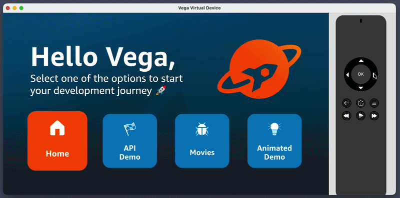

# Step 5: Replace Test & Debug with a movie list

In this step, you'll replace the **Test & Debug** tile with a **Movies** tile that fetches a movie catalog from a public endpoint and renders it as a horizontal list. On Expo TV and web you'll use `FlatList`. On Vega you'll use the TV-optimised **Carousel** from `@amazon-devices/vega-carousel`.

This builds directly on the fetch pattern from [Step 4](./step-04-add-api-demo.md). The httpClient you wrote there will do the network call. What's new here is how the same fetched data flows into two different list components depending on the platform.

## 5.1 Add a catalog service and hook

You'll reuse the `createHttpClient` you built in Step 4. Create `packages/shared/src/data/catalog.ts`:

```tsx
import {useState, useEffect} from 'react';
import {createHttpClient} from '../services/httpClient';

export interface Movie {
  id: string;
  title: string;
  category: string;
  genres: string[];
  rating_stars: number;
  release_year: number;
  images: {
    poster_16x9: string;
  };
  description: string;
}

export interface Catalog {
  catalog_version: string;
  updated_at: string;
  items: Movie[];
}

const CATALOG_URL = 'https://giolaq.github.io/scrap-tv-feed/catalog.json';

const catalogClient = createHttpClient();

export async function fetchCatalog(): Promise<Catalog> {
  const response = await catalogClient.get<Catalog>(CATALOG_URL);
  if (!response.ok) {
    throw new Error(`Catalog request failed with status ${response.status}`);
  }
  return response.data;
}

export interface UseMoviesResult {
  movies: Movie[];
  loading: boolean;
  error: string | null;
}

export function useMovies(): UseMoviesResult {
  const [movies, setMovies] = useState<Movie[]>([]);
  const [loading, setLoading] = useState(true);
  const [error, setError] = useState<string | null>(null);

  useEffect(() => {
    let cancelled = false;
    fetchCatalog()
      .then((catalog) => {
        if (!cancelled) {
          setMovies(catalog.items);
          setLoading(false);
        }
      })
      .catch((err) => {
        if (!cancelled) {
          setError(err instanceof Error ? err.message : 'Unknown error');
          setLoading(false);
        }
      });
    return () => {
      cancelled = true;
    };
  }, []);

  return {movies, loading, error};
}
```

A few things worth noticing:

- `fetchCatalog` uses the same `createHttpClient` from Step 4. No new networking code, just a new endpoint.
- `useMovies` wraps the fetch in a hook so both list variants (FlatList and Carousel) can share the loading/error/data flow.
- The `cancelled` flag stops us setting state on an unmounted component, which is easy to trip over when a user navigates away mid-fetch on a TV.

## 5.2 Create a shared MoviePoster component

Create `packages/shared/src/components/MovieList/MoviePoster.tsx`:

```tsx
import React, {useState, useCallback} from 'react';
import {View, Text, Image, Pressable, StyleSheet} from 'react-native';
import {scaleFontSize, scaleWidth, scaleHeight} from '../../utils/scaling';
import {Movie} from '../../data/catalog';

export interface MoviePosterProps {
  movie: Movie;
}

export const MoviePoster = ({movie}: MoviePosterProps) => {
  const [focused, setFocused] = useState(false);
  const onFocus = useCallback(() => setFocused(true), []);
  const onBlur = useCallback(() => setFocused(false), []);

  return (
    <Pressable
      onFocus={onFocus}
      onBlur={onBlur}
      style={[styles.container, focused && styles.containerFocused]}>
      <Image
        source={{uri: movie.images.poster_16x9}}
        style={styles.poster}
        resizeMode="cover"
      />
      <Text style={styles.title} numberOfLines={1}>
        {movie.title}
      </Text>
      <Text style={styles.meta}>
        {movie.release_year} · {movie.rating_stars.toFixed(1)}★
      </Text>
    </Pressable>
  );
};

const styles = StyleSheet.create({
  container: {
    width: scaleWidth(480),
    marginRight: scaleWidth(30),
  },
  containerFocused: {
    transform: [{scale: 1.1}],
  },
  poster: {
    width: scaleWidth(480),
    height: scaleHeight(270),
    borderRadius: scaleWidth(12),
    backgroundColor: '#222',
  },
  title: {
    color: '#FFFFFF',
    fontSize: scaleFontSize(32),
    fontWeight: 'bold',
    marginTop: scaleHeight(12),
  },
  meta: {
    color: '#CCCCCC',
    fontSize: scaleFontSize(24),
    marginTop: scaleHeight(4),
  },
});
```

Same `onFocus`/`onBlur` scaling pattern from earlier steps: when D-pad focus lands on a poster, it grows.

## 5.3 Create the FlatList variant

Create `packages/shared/src/components/MovieList/MovieList.tsx`. This is the default, used by Web, Android TV, and Apple TV:

```tsx
import React from 'react';
import {
  FlatList,
  StyleSheet,
  ActivityIndicator,
  Text,
  View,
} from 'react-native';
import {useMovies, Movie} from '../../data/catalog';
import {MoviePoster} from './MoviePoster';
import {scaleFontSize, scaleWidth, scaleHeight} from '../../utils/scaling';

export const MovieList = () => {
  const {movies, loading, error} = useMovies();

  if (loading) {
    return (
      <View style={styles.centered}>
        <ActivityIndicator size="large" color="#FFFFFF" />
      </View>
    );
  }

  if (error) {
    return (
      <View style={styles.centered}>
        <Text style={styles.error}>{error}</Text>
      </View>
    );
  }

  return (
    <FlatList
      horizontal
      data={movies}
      keyExtractor={(item: Movie) => item.id}
      renderItem={({item}) => <MoviePoster movie={item} />}
      showsHorizontalScrollIndicator={false}
      contentContainerStyle={styles.content}
      style={styles.list}
    />
  );
};

const styles = StyleSheet.create({
  list: {
    width: '100%',
  },
  content: {
    paddingHorizontal: scaleWidth(20),
    paddingVertical: scaleHeight(20),
  },
  centered: {
    flex: 1,
    justifyContent: 'center',
    alignItems: 'center',
  },
  error: {
    color: '#FFFFFF',
    fontSize: scaleFontSize(40),
  },
});
```

`FlatList` virtualises rows and only renders what's on screen plus a small buffer. That's plenty for a 25-item catalog and it keeps scroll smooth on web and TVOS.

## 5.4 Create the Vega Carousel variant

For Vega, swap `FlatList` for the Amazon Devices Carousel. It has a slightly different API — a `dataAdapter` object instead of a `data` array — but the same `useMovies` hook feeds it. Create `packages/shared/src/components/MovieList/MovieList.kepler.tsx`:

```tsx
import React, {useCallback} from 'react';
import {Text, ActivityIndicator, StyleSheet} from 'react-native';
import {Carousel, CarouselRenderInfo} from '@amazon-devices/vega-carousel';
import {TVFocusGuideView} from '@amazon-devices/react-native-kepler';
import {useMovies, Movie} from '../../data/catalog';
import {MoviePoster} from './MoviePoster';
import {scaleFontSize, scaleWidth, scaleHeight} from '../../utils/scaling';

export const MovieList = () => {
  const {movies, loading, error} = useMovies();

  const getItem = useCallback(
    (index: number) =>
      index >= 0 && index < movies.length ? movies[index] : undefined,
    [movies],
  );
  const getItemCount = useCallback(() => movies.length, [movies]);
  const getItemKey = (info: CarouselRenderInfo<Movie>) => info.item.id;
  const notifyDataError = () => false;
  const renderItem = (info: CarouselRenderInfo<Movie>) => (
    <MoviePoster movie={info.item} />
  );

  if (loading) {
    return (
      <ActivityIndicator size="large" color="#FFFFFF" style={styles.centered} />
    );
  }
  if (error) {
    return <Text style={styles.error}>{error}</Text>;
  }
  if (movies.length === 0) {
    return null;
  }

  return (
    <TVFocusGuideView autoFocus={true} style={styles.container}>
      <Carousel
        dataAdapter={{getItem, getItemCount, getItemKey, notifyDataError}}
        renderItem={renderItem}
        uniqueId="movie-carousel"
      />
    </TVFocusGuideView>
  );
};

const styles = StyleSheet.create({
  container: {
    width: '100%',
    height: scaleHeight(400),
    paddingHorizontal: scaleWidth(20),
  },
  centered: {flex: 1},
  error: {color: '#FFFFFF', fontSize: scaleFontSize(40)},
});
```

A few things worth noticing:

- The `dataAdapter` gives the Carousel functions to look up items by index. It uses that to recycle views efficiently for very large catalogs.
- **`getItem` must return `undefined` for out-of-bounds indices.** The Carousel probes indices beyond the current count during scroll, and returning `movies[index]` directly (which would be `undefined`) crashes native code that expects a valid item shape. Guard the bounds explicitly.
- **`getItemKey` receives a `CarouselRenderInfo`, not a raw index.** It's `(info) => key`, where `info.item` and `info.index` are available — different from a `FlatList` `keyExtractor`.
- We short-circuit with `if (movies.length === 0) return null` so the Carousel is never mounted with an empty adapter.
- `TVFocusGuideView` with `autoFocus` wraps the Carousel so pressing **Up** from the Movies tile hands focus into the carousel row. Without it, focus would just stay on the tile row.
- We're relying on defaults for `orientation`, `renderedItemsCount`, `numOffsetItems`, and `initialStartIndex`. All of those are perf knobs you can tune later (see the docs) — the defaults are fine for a 25-item catalog.

For the full prop reference, see the [Vega Carousel docs](https://developer.amazon.com/docs/vega-api/0.24/vega-carousel.html) and [Focus Management on Vega](https://developer.amazon.com/docs/vega/0.24/focus-management.html).

## 5.5 Add the Vega Carousel dependency

Update `packages/vega/package.json` to include the new package:

```json
"dependencies": {
  "@amazon-devices/vega-carousel": "^0.1.0",
  ...
}
```

Then reinstall:

```bash
yarn
```

## 5.6 Replace the Test & Debug tile

Open `packages/shared/src/data/tiles.tsx` and swap the `debug` tile for a `movies` tile:

```tsx
{
  id: 'movies',
  label: 'Movies',
  accessibilityLabel: 'Movies',
  description:
    'A horizontal list of movies fetched from a public endpoint. FlatList on Expo TV and web, Carousel on Vega.',
  icon: require('../assets/debug.png'),
},
```

We're reusing the existing debug icon to keep the workshop simple. Swap it for something more movie-shaped if you like.

## 5.7 Render the MovieList when Movies is focused

Update `packages/shared/src/screens/HomeScreen.tsx` to render the list in the focused-content area:

```tsx
// Add the import at the top
import {MovieList} from '../components/MovieList/MovieList';

// Then in renderFocusedContent, add the movies case above the fallback:
if (focusedTileId === 'movies') {
  return <MovieList />;
}
```

Metro picks the right file automatically:

- `MovieList.kepler.tsx` on Vega (Fire TV)
- `MovieList.tsx` on Expo TV and web

Same import path, different implementations, no `Platform.select()` needed.

### Stop resetting focus on tile blur

The starter `HomeScreen` resets the focused-content area back to `'home'` whenever any tile blurs:

```tsx
const handleTileBlur = useCallback(() => {
  setFocusedTileId('home');
}, []);
```

That was fine when tiles only ever showed a description. It's a problem now: pressing **Up** from the Movies tile blurs it, which unmounts the MovieList before focus can travel into the carousel. Focus falls back to the home tile instead.

Change the blur handler to a no-op so the last-focused content stays mounted while focus moves up into it:

```tsx
const handleTileBlur = useCallback(() => {
  // No-op: keep the focused-content area showing the last-focused tile's
  // content so users can move focus up into it (e.g. into the Movies
  // carousel) without unmounting it.
}, []);
```

Now the flow works: focus Movies → carousel appears → press Up → `TVFocusGuideView` hands focus to the carousel → press Down → focus returns to the tile row.

## 5.8 Export the new pieces

Update `packages/shared/index.ts` so the movie list and hook are part of the shared public API:

```tsx
export {MovieList} from './src/components/MovieList/MovieList';
export {MoviePoster} from './src/components/MovieList/MoviePoster';
export {fetchCatalog, useMovies} from './src/data/catalog';
export type {Movie, Catalog} from './src/data/catalog';
```

## 5.9 Run and compare

Build and run on Vega. In Vega Studio, click the play button in the sidebar (see [Step 1](./step-01-setup-and-run.md#option-a-build-and-run-from-vega-studio-ide)). Or from the CLI:

```bash
yarn vega:build
yarn vega:vvd:mseries  # or yarn vega:vvd:intel
```

Focus the **Movies** tile. You should see a spinner briefly, then a horizontal carousel of posters. Use the D-pad to scroll left and right, and watch how the focused poster scales up.



Now run on web:

```bash
yarn expotv:web
```

Or run on Android TV (`yarn expotv:android`) or Apple TV (`yarn expotv:ios`) if you have those emulators set up. See [Step 1: Run on another platform](./step-01-setup-and-run.md#13-run-on-another-platform).

Same fetch, same posters, but rendered by `FlatList`. Scroll with the arrow keys.

## What you've learned

- **Reusing shared services**: Step 4's httpClient handled the network call for a different endpoint with no changes.
- **A shared hook, two views**: `useMovies` centralises the loading/error/data flow. Each list component just decides how to render.
- **Platform file extensions for list components**: same import, different implementation per platform, no `Platform.select()`.
- **`FlatList` vs `Carousel`**: platform-specific files let Vega use its Carousel while the other platforms use React Native's `FlatList`. Step 6 shows you how to compare their scrolling performance on Vega.

In [Step 6](./step-06-test-scrolling-performance-with-adbt.md), you'll measure both list implementations on a physical Vega device and compare the results.

---

**Next:** [Step 6: Compare scrolling performance on Vega →](./step-06-test-scrolling-performance-with-adbt.md)
