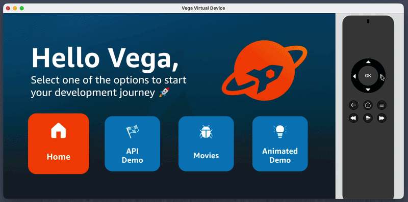

# Step 5: Replace Test & Debug with a movie list

In this step, you'll replace the **Test & Debug** tile with a **Movies** tile that fetches a movie catalog from a public endpoint and renders it as a horizontal list. On Expo TV and web you'll use `FlatList`. On Vega you'll use the TV-optimised **Carousel** from `@amazon-devices/vega-carousel`.

This builds on the fetch pattern from [Step 4](./step-04-add-api-demo.md) — the httpClient you wrote there does the network call. What's new is how the same fetched data flows into different list components per platform.

## 5.1 Add a catalog service and hook

You'll reuse the `createHttpClient` you built in Step 4. Create `packages/shared/src/data/catalog.ts`:

```tsx
import {useState, useEffect} from 'react';
import {createHttpClient} from '../services/httpClient';

export interface Movie {
  id: string;
  title: string;
  category: string;
  genres: string[];
  rating_stars: number;
  release_year: number;
  images: {
    poster_16x9: string;
  };
  description: string;
}

export interface Catalog {
  catalog_version: string;
  updated_at: string;
  items: Movie[];
}

const CATALOG_URL = 'https://giolaq.github.io/scrap-tv-feed/catalog.json';

const catalogClient = createHttpClient();

export async function fetchCatalog(): Promise<Catalog> {
  const response = await catalogClient.get<Catalog>(CATALOG_URL);
  if (!response.ok) {
    throw new Error(`Catalog request failed with status ${response.status}`);
  }
  return response.data;
}

export interface UseMoviesResult {
  movies: Movie[];
  loading: boolean;
  error: string | null;
}

export function useMovies(): UseMoviesResult {
  const [movies, setMovies] = useState<Movie[]>([]);
  const [loading, setLoading] = useState(true);
  const [error, setError] = useState<string | null>(null);

  useEffect(() => {
    let cancelled = false;
    fetchCatalog()
      .then(catalog => {
        if (!cancelled) {
          setMovies(catalog.items);
          setLoading(false);
        }
      })
      .catch(err => {
        if (!cancelled) {
          setError(err instanceof Error ? err.message : 'Unknown error');
          setLoading(false);
        }
      });
    return () => {
      cancelled = true;
    };
  }, []);

  return {movies, loading, error};
}
```

The `cancelled` flag stops us setting state on an unmounted component — easy to trip over when a user navigates away mid-fetch on a TV.

## 5.2 Create a shared MoviePoster component

Create `packages/shared/src/components/MovieList/MoviePoster.tsx`:

```tsx
import React, {useState, useCallback} from 'react';
import {View, Text, Image, Pressable, StyleSheet} from 'react-native';
import {scaleFontSize, scaleWidth, scaleHeight} from '../../utils/scaling';
import {Movie} from '../../data/catalog';

export interface MoviePosterProps {
  movie: Movie;
  hasTVPreferredFocus?: boolean;
}

export const MoviePoster = ({movie, hasTVPreferredFocus}: MoviePosterProps) => {
  const [focused, setFocused] = useState(false);

  const onFocus = useCallback(() => setFocused(true), []);
  const onBlur = useCallback(() => setFocused(false), []);

  return (
    <Pressable
      onFocus={onFocus}
      onBlur={onBlur}
      hasTVPreferredFocus={hasTVPreferredFocus}
      style={[styles.container, focused && styles.containerFocused]}>
      <Image
        source={{uri: movie.images.poster_16x9}}
        style={styles.poster}
        resizeMode="cover"
      />
      <Text style={styles.title} numberOfLines={1}>
        {movie.title}
      </Text>
      <Text style={styles.meta}>
        {movie.release_year} · {movie.rating_stars.toFixed(1)}★
      </Text>
    </Pressable>
  );
};

const styles = StyleSheet.create({
  container: {
    width: scaleWidth(480),
    marginRight: scaleWidth(30),
    opacity: 0.5,
  },
  containerFocused: {
    opacity: 1,
    transform: [{scale: 1.05}],
  },
  poster: {
    width: scaleWidth(480),
    height: scaleHeight(270),
    borderRadius: scaleWidth(12),
    backgroundColor: '#222',
  },
  title: {
    color: '#FFFFFF',
    fontSize: scaleFontSize(32),
    fontWeight: 'bold',
    marginTop: scaleHeight(12),
  },
  meta: {
    color: '#CCCCCC',
    fontSize: scaleFontSize(24),
    marginTop: scaleHeight(4),
  },
});
```

## 5.3 Create a FocusRow wrapper

Both list variants (FlatList and Carousel) need the same thing from their container: something that pulls D-pad focus in and remembers which child was last focused. Every platform has this primitive under a different name — wrap the differences behind a shared `FocusRow` using platform file extensions, same pattern as `HeaderLogo` in Step 2.

`packages/shared/src/components/FocusRow/FocusRow.tsx` (Android TV and Apple TV, via `react-native-tvos`):

```tsx
import React from 'react';
import {ViewStyle, StyleProp} from 'react-native';

// eslint-disable-next-line @typescript-eslint/no-var-requires
const {TVFocusGuideView} = require('react-native');

export interface FocusRowProps {
  children: React.ReactNode;
  style?: StyleProp<ViewStyle>;
  contentContainerStyle?: StyleProp<ViewStyle>;
}

export const FocusRow = ({children, style, contentContainerStyle}: FocusRowProps) => {
  return (
    <TVFocusGuideView autoFocus style={[style, contentContainerStyle]}>
      {children}
    </TVFocusGuideView>
  );
};
```

The other two variants use the same props and body — only the wrapper changes:

- **`FocusRow.web.tsx`** — swap `TVFocusGuideView` for a plain `View` (browsers don't have TV focus).
- **`FocusRow.kepler.tsx`** — import `TVFocusGuideView` from `@amazon-devices/react-native-kepler` instead of `react-native` (Vega's guide lives in a separate package).

`autoFocus` does the work: when focus enters the row, the guide re-focuses whichever child was last focused (or the first focusable child on first visit).

## 5.4 Create the FlatList variant

Create `packages/shared/src/components/MovieList/MovieList.tsx`. This is the default, used by Web, Android TV, and Apple TV:

```tsx
import React from 'react';
import {
  FlatList,
  StyleSheet,
  ActivityIndicator,
  Text,
  View,
} from 'react-native';
import {useMovies, Movie} from '../../data/catalog';
import {MoviePoster} from './MoviePoster';
import {FocusRow} from '../FocusRow/FocusRow';
import {scaleFontSize, scaleWidth, scaleHeight} from '../../utils/scaling';

export const MovieList = () => {
  const {movies, loading, error} = useMovies();

  if (loading) {
    return (
      <View style={styles.centered}>
        <ActivityIndicator size="large" color="#FFFFFF" />
      </View>
    );
  }

  if (error) {
    return (
      <View style={styles.centered}>
        <Text style={styles.error}>{error}</Text>
      </View>
    );
  }

  return (
    <FocusRow style={styles.container}>
      <FlatList
        horizontal
        data={movies}
        keyExtractor={(item: Movie) => item.id}
        renderItem={({item, index}) => (
          <MoviePoster movie={item} hasTVPreferredFocus={index === 0} />
        )}
        showsHorizontalScrollIndicator={false}
        contentContainerStyle={styles.content}
        style={styles.list}
      />
    </FocusRow>
  );
};

const styles = StyleSheet.create({
  container: {
    width: '100%',
    height: scaleHeight(400),
  },
  list: {
    width: '100%',
  },
  content: {
    paddingHorizontal: scaleWidth(20),
    paddingVertical: scaleHeight(20),
  },
  centered: {
    flex: 1,
    justifyContent: 'center',
    alignItems: 'center',
  },
  error: {
    color: '#FFFFFF',
    fontSize: scaleFontSize(40),
  },
});
```

A few things worth noticing:

- **`FocusRow` wraps the `FlatList`.** `autoFocus` pulls D-pad focus into the list, and the native `ScrollView` inside `FlatList` scrolls the focused poster into view on its own — same visual outcome as the Vega Carousel, no `scrollToIndex` needed.
- **`container` has a fixed `height`.** Without it the `FlatList` stretches vertically and overlaps the tile row below.

## 5.5 Create the Vega Carousel variant

For Vega, swap `FlatList` for the Amazon Devices Carousel. It has a slightly different API — a `dataAdapter` object instead of a `data` array — but the same `useMovies` hook feeds it. Create `packages/shared/src/components/MovieList/MovieList.kepler.tsx`:

```tsx
import React, {useCallback} from 'react';
import {Text, ActivityIndicator, StyleSheet} from 'react-native';
import {Carousel, CarouselRenderInfo} from '@amazon-devices/vega-carousel';
import {useMovies, Movie} from '../../data/catalog';
import {MoviePoster} from './MoviePoster';
import {FocusRow} from '../FocusRow/FocusRow';
import {scaleFontSize, scaleWidth, scaleHeight} from '../../utils/scaling';

export const MovieList = () => {
  const {movies, loading, error} = useMovies();

  const getItem = useCallback(
    (index: number) =>
      index >= 0 && index < movies.length ? movies[index] : undefined,
    [movies],
  );
  const getItemCount = useCallback(() => movies.length, [movies]);
  const getItemKey = (info: CarouselRenderInfo<Movie>) => info.item.id;
  const notifyDataError = () => false;
  const renderItem = (info: CarouselRenderInfo<Movie>) => (
    <MoviePoster movie={info.item} />
  );

  if (loading) {
    return <ActivityIndicator size="large" color="#FFFFFF" style={styles.centered} />;
  }
  if (error) {
    return <Text style={styles.error}>{error}</Text>;
  }
  if (movies.length === 0) {
    return null;
  }

  return (
    <FocusRow style={styles.container}>
      <Carousel
        dataAdapter={{getItem, getItemCount, getItemKey, notifyDataError}}
        renderItem={renderItem}
        uniqueId="movie-carousel"
        hasPreferredFocus={true}
      />
    </FocusRow>
  );
};

const styles = StyleSheet.create({
  container: {
    width: '100%',
    height: scaleHeight(400),
    paddingHorizontal: scaleWidth(20),
  },
  centered: {flex: 1},
  error: {color: '#FFFFFF', fontSize: scaleFontSize(40)},
});
```

A few things worth noticing:

- **`dataAdapter` replaces `data`.** The Carousel doesn't take an array — you give it `getItem`, `getItemCount`, and `getItemKey` so it can recycle views for very large catalogs.
- **`getItem` must return `undefined` for out-of-bounds indices.** The Carousel probes past the current count during scroll; returning `movies[index]` directly (which is `undefined`) crashes native code that expects a valid item.
- **`hasPreferredFocus={true}`** makes focus jump straight to the first poster the moment `MovieList` mounts — no extra Up press. It doesn't retrigger on return, so the user can navigate away normally.

Everything else uses the Carousel's defaults; see the [Vega Carousel docs](https://developer.amazon.com/docs/vega-api/0.24/vega-carousel.html) if you want to tune.

## 5.6 Add the Vega Carousel dependency

Update `packages/vega/package.json` to include the new package:

```json
"dependencies": {
  "@amazon-devices/vega-carousel": "^0.1.0",
  ...
}
```

Then reinstall:

```bash
yarn
```

## 5.7 Replace the Test & Debug tile

Open `packages/shared/src/data/tiles.tsx` and swap the `debug` tile for a `movies` tile:

```tsx
{
  id: 'movies',
  label: 'Movies',
  accessibilityLabel: 'Movies',
  description:
    'A horizontal list of movies fetched from a public endpoint. FlatList on Expo TV and web, Carousel on Vega.',
  icon: require('../assets/debug.png'),
},
```

We're reusing the existing debug icon to keep the workshop simple. Swap it for something more movie-shaped if you like.

## 5.8 Render the MovieList when Movies is focused

Update `packages/shared/src/screens/HomeScreen.tsx` to render the list when the Movies tile is focused:

```tsx
// Add the import at the top
import {MovieList} from '../components/MovieList/MovieList';

// Then in renderFocusedContent, add the movies case above the fallback:
if (activeTileId === 'movies') {
  return <MovieList />;
}
```

Metro picks the right file automatically — `MovieList.kepler.tsx` on Vega, `MovieList.tsx` everywhere else. Same import path, no `Platform.select()` needed.

### Split "active" from "focused" so focus can leave the tile row

`HomeScreen` currently uses one variable — `focusedTileId` — to track both "which tile owns the content area" and "which tile is highlighted". That breaks the moment focus needs to leave the tile row and enter the Carousel above: clearing it unmounts the MovieList; not clearing it leaves the Movies tile lit orange while a poster is also focused.

Split the one variable into the two things it was actually tracking:

```tsx
const [activeTileId, setActiveTileId] = useState<string>('home');
const [focusedTileId, setFocusedTileId] = useState<string | null>('home');

const handleTileFocus = useCallback((id: string) => {
  setActiveTileId(id);
  setFocusedTileId(id);
}, []);

const handleTileBlur = useCallback(() => {
  setFocusedTileId(null);
}, []);
```

`activeTileId` never goes null, so the content area stays mounted while focus travels up into it. `focusedTileId` goes null on blur so the tile's orange highlight clears when focus moves into the Carousel.

`Tile` also gets a third visual state so it can show "I own the content but I don't have focus" — **active** sits between **default** and **focused**. In `packages/shared/src/components/Tile.tsx`, add an `isActive?: boolean` prop and pick the right style block:

```tsx
export interface TileProps {
  // ...existing props
  isFocused: boolean;
  isActive?: boolean;
  // ...
}

const stateStyle = isFocused
  ? styles.focused
  : isActive
    ? styles.active
    : styles.default;

return (
  <TouchableOpacity style={[styles.tile, stateStyle]} /* ... */>
    {/* ... */}
  </TouchableOpacity>
);
```

Add the `active` style and give the base `tile` a `borderWidth` so the outline doesn't nudge the layout when it appears:

```tsx
const styles = StyleSheet.create({
  tile: {
    // ...existing
    borderWidth: scaleWidth(6),
  },
  default: {
    backgroundColor: '#0074B8',
    borderColor: 'transparent',
  },
  active: {
    backgroundColor: '#0074B8',
    borderColor: '#FF6200',
  },
  focused: {
    backgroundColor: '#FF6200',
    borderColor: '#FF6200',
    transform: [{scale: 1.1}],
    opacity: 1,
  },
  // ...
});
```

Now wire the new state through in `HomeScreen`:

```tsx
<Tile
  key={tile.id}
  // ...existing props
  isFocused={focusedTileId === tile.id}
  isActive={focusedTileId !== tile.id && activeTileId === tile.id}
  onFocus={handleTileFocus}
  onBlur={handleTileBlur}
/>
```

Finally, rename `focusedTileId` to `activeTileId` in the parts of `renderFocusedContent` that decide what to show (and `focusedTile` to `activeTile` in the fallback). The header area follows the active tile now, not focus — that's how the Movies content stays mounted after focus leaves the tile row.

### Wrap the tile row in FocusRow

The `FocusRow` from 5.3 fits the tile row too. Without it, pressing **Down** from the Carousel returns focus to whichever tile is geometrically below the focused poster — usually **Home**, not **Movies**. `autoFocus` remembers the last focused child so focus goes back to Movies.

Swap the tile row's outer `<View>` for `<FocusRow>`:

```tsx
import {FocusRow} from '../components/FocusRow/FocusRow';

// ...

<FocusRow
  style={styles.tileRowScroll}
  contentContainerStyle={styles.tileRowContent}>
  {tiles.map(tile => (
    <Tile ... />
  ))}
</FocusRow>
```

Split the styles — outer for the flex slot, `contentContainerStyle` for the layout:

```tsx
tileRowScroll: {
  flex: 1,
},
tileRowContent: {
  flexGrow: 1,
  flexDirection: 'row',
  alignItems: 'flex-end',
  justifyContent: 'space-between',
},
```

Now the full flow works: focus Movies → the Carousel takes focus on mount (via `hasPreferredFocus`) → scroll with Left/Right → press Down → the tile row `FocusRow` remembers Movies was last focused and puts focus back there.

On Android TV, one residual quirk: pressing **Right** from the Movies tile can jump into the Carousel above rather than along to the next tile. That's Android TV's proximity-based focus engine choosing the nearer element. Down brings you back. Vega doesn't do this.

## 5.9 Export the new pieces

Update `packages/shared/index.ts` so the movie list and hook are part of the shared public API:

```tsx
export {MovieList} from './src/components/MovieList/MovieList';
export {MoviePoster} from './src/components/MovieList/MoviePoster';
export {fetchCatalog, useMovies} from './src/data/catalog';
export type {Movie, Catalog} from './src/data/catalog';
```

## 5.10 Run and compare

Build and run on Vega. In Vega Studio, click the play button in the sidebar (see [Step 1](./step-01-setup-and-run.md#option-a-build-and-run-from-vega-studio-ide)). Or from the CLI:

```bash
yarn vega:build
yarn vega:vvd:mseries  # or yarn vega:vvd:intel
```

Focus the **Movies** tile. You should see a spinner briefly, then a horizontal carousel of posters. Use the D-pad to scroll left and right, and watch how the focused poster scales up.



Now run on web:

```bash
yarn expotv:web
```

Or run on Android TV (`yarn expotv:android`) or Apple TV (`yarn expotv:ios`) if you have those emulators set up — see [Step 1: Run on another platform](./step-01-setup-and-run.md#13-run-on-another-platform). Same fetch, same posters, but rendered by `FlatList`. Scroll with the arrow keys.

## What you've learned

- **Reusing shared services**: Step 4's httpClient handled the network call for a different endpoint with no changes.
- **A shared hook, two views**: `useMovies` centralises the loading/error/data flow. Each list component just decides how to render.
- **`FocusRow` as a cross-platform focus guide**: one abstraction, three platform files. `TVFocusGuideView` from `react-native-tvos` on Android TV / Apple TV, from `@amazon-devices/react-native-kepler` on Vega, plain `View` on web.
- **Splitting `active` from `focused`**: one state per intent avoids doubled focus indicators and lets focus leave the tile row without unmounting the content above.
- **`FlatList` vs `Vega Carousel`**: platform-specific files let Vega use its native Carousel while everywhere else uses `FlatList`. Step 6 compares them on a real Vega device.

---

**Next:** [Step 6: Compare scrolling performance on Vega →](./step-06-test-scrolling-performance-with-adbt.md)
